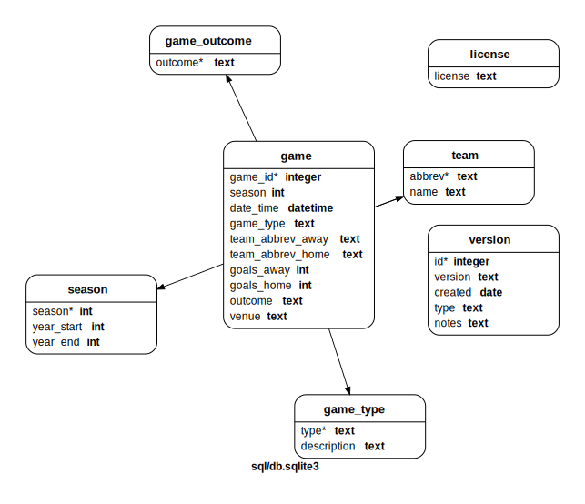

***********
 nhl-sqlite
***********

.. image:: https://github.com/nutratech/nhlsqlite/actions/workflows/test.yml/badge.svg
    :target: https://github.com/nutratech/nhlsqlite/actions/workflows/test.yml

Python, SQL and CSV files for setting up portable nhl-sqlite database.

See CLI:    https://github.com/nutratech/nhl-rank

Pypi page:  https://pypi.org/project/nhl-rank

Building the database
#########################

Initialize the virtual environment and development space.

.. code-block:: bash

    make init

Create the database, verify the tables were created & populated, and generate
the SQL relational diagram (graph of table structure).

.. code-block:: bash

    make build test docs

If everything looks good, commit & update submodule in the ``cli`` repository.

Note on versioning
~~~~~~~~~~~~~~~~~~

If you are committing database changes, add a line to ``sql/data/version.csv``
(``id=4`` is the latest in this case).

+----+---------+------------+-----------------------+-----------------+
| id | version | created    | type                  | notes           |
+====+=========+============+=======================+=================+
| 1  | 0.0.0   | 2020-09-22 | feature               | initial release |
+----+---------+------------+-----------------------+-----------------+
| 2  | 0.0.1   | 2021-05-21 | doc                   | bump version    |
+----+---------+------------+-----------------------+-----------------+
| 3  | 0.0.2   | 2021-05-24 | deprecation, breaking | remove guids    |
+----+---------+------------+-----------------------+-----------------+
| 4  | 0.0.3   | 2021-05-24 | chore                 | general cleanup |
+----+---------+------------+-----------------------+-----------------+

First column    second column
1-on-1          2021-05-24

Tables (Relational Design)
##########################

**Note:** functions are kept in ``sql/functions.sql``.

See ``sql/tables.sql`` for details on design.

This is frequently updated, see ``docs/`` for more info.

